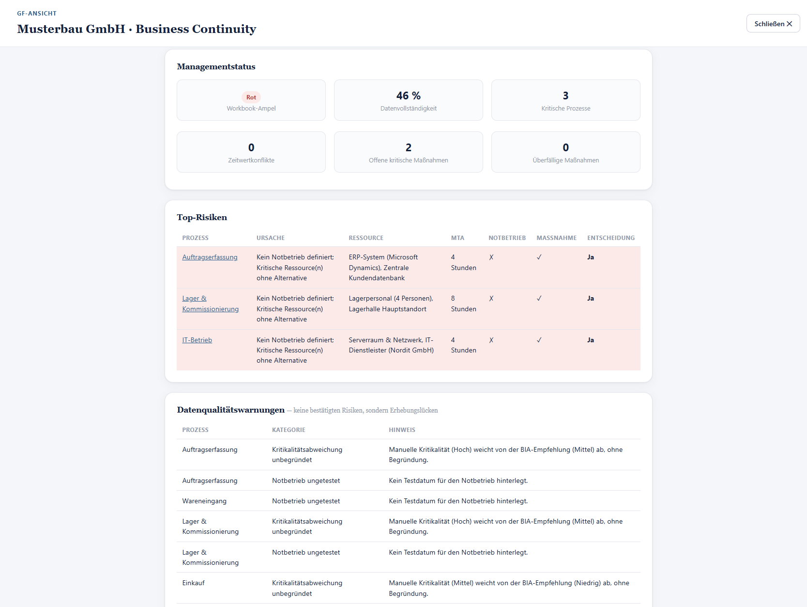

<p align="center">
  
</p>

<h3 align="center">Open Source Edition</h3>

<p align="center">
  A single-file, offline Business Continuity Management workbook.<br>
  No installation. No account. No cloud. No tracking.
</p>

<p align="center">
  <a href="LICENSE"></a>
  
  
  
</p>

<p align="center">
  
</p>

*(Executive view, with the fictional demo workbook loaded. Further screenshots are still missing — see [Screenshots](#screenshots) below.)*

---

## What is this?

**BCM Starter Kit** is a complete Business Continuity Management (BCM) workbook packaged as a single HTML file. Open it in a browser and you have process records, business impact analysis, minimum viable capability planning, critical resource tracking, emergency operations documentation, resilience checks, a measures catalog, version history, and PDF reporting — with nothing to install and nothing leaving your machine unless you choose to export it.

It was originally built for practical, hands-on BCM work in small and mid-sized organizations that need a structured starting point without procuring, deploying, or paying for a full GRC platform.

## Why this exists

Most Business Continuity Management tooling falls into one of two categories: expensive enterprise GRC suites that are overkill for a first BCM initiative, or a scattering of spreadsheets and Word templates with no structure connecting them. BCM Starter Kit is meant to sit between the two — structured enough to produce a defensible, audit-ready result, simple enough that a single file you can email, put on a USB stick, or check into a private repository *is* the entire deployment.

## Key features

- **Process records** — steckbrief, 60-second pitch, business impact analysis, minimum viable capability, critical resources, emergency operations, resilience check, and measures per process, with a completeness indicator throughout.
- **Structured dependencies** — process-to-process dependencies by ID (not free text), with detection of cycles, contradictions, and orphaned references, and a multi-step critical-chain analysis.
- **Data-quality-aware management view** — a compact executive dashboard that keeps confirmed risks strictly separate from data-quality gaps, so an incomplete field is never mistaken for a validated finding.
- **Release governance** — a configurable readiness check with hard blockers and acknowledgeable warnings before a workbook can be marked "Approved"; approval automatically snapshots an immutable version.
- **Versioning built in** — every saved version is checksummed and comparable against any other, without needing external version control.
- **PDF reporting** — a genuinely short executive summary and a full detailed report, both generated entirely client-side via the browser's print function.
- **Encryption where you need it** — optional password-protected export (AES-GCM with a PBKDF2-derived key, 600,000 iterations, via the Web Crypto API) for sharing over channels you don't fully trust. Files written by earlier versions remain readable.
- **126 built-in self-tests** — a hidden self-check suite validates core logic using synthetic data only, without ever touching your workbook.
- **Review Center** *(2.4.0-dev, in development on `feature/2.4-governance-lifecycle`)* — plans, tracks and prioritizes recurring reviews (process, BIA, emergency operations, resources) per process, with deterministically computed overdue/upcoming flags and no opaque scoring. Each review type can have its own optional review-cycle policy (3/6/12/24 months, custom, or event-driven) — no due date is ever invented when no policy is set.
- **Measures management 2.0** *(2.4.0-dev)* — measures now track where they came from (review, parking lot, quality finding, resilience check, or manual), a six-value status model (open/planned/in progress/blocked/done/discarded — "done" still never implies "effective"), and plausibility hints (blocked without a reason, done without effectiveness proof).
- **BCM Timeline** *(2.4.0-dev)* — a filterable, chronological view of business-relevant BCM events (process created, reviews planned/started/completed, measures created/completed, effectiveness checked, criticality/MTA/RTO/RPO/emergency-operations changes, versions and releases), derived entirely from existing timestamped data rather than a separate audit log.
- **Governance Dashboard** *(2.4.0-dev)* — a deterministic, explained "what do I need to do next?" list on the landing page, combining review, measure, decision, and data-quality signals with no score, no AI, and no stored KPIs — everything is recomputed from existing data on every render.

## Getting started

1. Download [`bcm-starter-kit.html`](bcm-starter-kit.html) (or clone this repository).
2. Open the file in a modern desktop browser — double-click it, or drag it into a browser window.
3. Accept the license notice on first launch.
4. Either start with an empty workbook, or click **Load sample data** to explore a fictional demo company first.

No server, no build step, no dependencies to install. See [`docs/quickstart.md`](docs/quickstart.md) for a full walkthrough in under ten minutes, or [`docs/user-guide.md`](docs/user-guide.md) for complete documentation.

### Try the demo workbook

[`examples/demo-workbook.json`](examples/demo-workbook.json) contains a fictional company ("Musterbau GmbH") with six fully worked-out processes, eleven resources and nine structured dependencies. Open BCM Starter Kit, click **Import JSON** in the top bar, and load it to see every feature populated with realistic (fictional) data. See [`examples/README.md`](examples/README.md).

## Offline by design

BCM Starter Kit makes no network requests of its own once loaded, and does not embed any analytics, telemetry, or third-party scripts. There is no server component — everything runs in your browser. See [`docs/data-storage-and-privacy.md`](docs/data-storage-and-privacy.md) for the full picture, including exactly what is stored where and what you are responsible for when sharing exported files.

## Where your data lives

By default, your workbook is kept in the browser's local storage on the device you're using. On Chromium-based browsers (Chrome, Edge, Opera, Brave) you can additionally link the app to a real file on disk via the File System Access API — every change is then written straight to that file, similar to a desktop word processor. On other browsers, use the built-in JSON export/import instead. Nothing is ever sent anywhere automatically.

## Browser compatibility

| Feature | Chrome / Edge / Opera / Brave | Firefox | Safari |
|---|---|---|---|
| Core application | ✅ | ✅ | ✅ |
| Local storage autosave | ✅ | ✅ | ✅ |
| Direct file linking (File System Access API) | ✅ | ❌ (use JSON export/import) | ❌ (use JSON export/import) |
| PDF export (via browser print) | ✅ | ✅ | ✅ |
| Encrypted export/import (Web Crypto API) | ✅ | ✅ | ✅ |

A recent desktop browser is recommended; the interface is not optimized for small mobile screens.

## License

BCM Starter Kit is licensed under the [Apache License, Version 2.0](LICENSE). You are free to use, modify, and redistribute it — including commercially — provided that copyright and license notices are preserved and that any files you change are marked as changed. See [NOTICE](NOTICE) for the required attribution notice.

```
Copyright © 2026 Marco Riemer
Originally developed by Marco Riemer — https://www.riemer-consulting.de
Licensed under the Apache License, Version 2.0.
```

## Contributing

Contributions are welcome — bug reports, documentation improvements, and pull requests alike. Please read [CONTRIBUTING.md](CONTRIBUTING.md) before opening a pull request, and note that **this project intentionally does not add fachlich (business-logic) features casually**: the data model and migration chain are treated as a stable contract. See [CODE_OF_CONDUCT.md](CODE_OF_CONDUCT.md) for community expectations.

## Roadmap

BCM Starter Kit was considered **functionally complete** for its original 2.x scope. Version **2.4.0 "Governance & Lifecycle"** (in development on `feature/2.4-governance-lifecycle`) completes the ongoing BCM lifecycle on top of that — Review Center, review cycles, Measures management 2.0, BCM Timeline, and the Governance Dashboard — see [`roadmap/RELEASE_2_4.md`](roadmap/RELEASE_2_4.md). Beyond finishing 2.4, there is no committed roadmap of further new business features; a possible 2.5 is scoped to Reporting & Compliance only (see [`roadmap/RELEASE_2_5.md`](roadmap/RELEASE_2_5.md)). Other future work is expected to focus on:

- Documentation and translation improvements — the application's own interface is German-only, and there is no internationalization infrastructure in place today
- Additional demo/example workbooks
- Remaining accessibility work — version 2.2.0 covered labelling, keyboard operability, dialog semantics and focus handling; screen-reader testing with real assistive technology and a formal WCAG conformance assessment have **not** been carried out
- The missing screenshots listed below
- Community-contributed bug fixes

Substantial changes to the data model or migration chain will always be treated as a major, carefully considered decision — see [`docs/architecture.md`](docs/architecture.md).

## Supported versions

| Version | Status |
|---|---|
| 2.x | ✅ Actively supported |
| < 2.0 | ❌ No longer supported — please upgrade |

See [SECURITY.md](SECURITY.md) for how to report a vulnerability and [SUPPORT.md](SUPPORT.md) for how to get help.

## Documentation

- [Quickstart](docs/quickstart.md) — first ten minutes
- [User Guide](docs/user-guide.md) — complete reference
- [Architecture](docs/architecture.md) — how the application is built
- [Data Storage & Privacy](docs/data-storage-and-privacy.md)
- [Release Process](docs/release-process.md)
- [FAQ](docs/faq.md)

## Screenshots

Four screenshots exist; the rest still need to be captured manually from a running instance — see the note in [`assets/screenshots/README.md`](assets/screenshots/README.md).

| View | File | Present |
|---|---|---|
| Executive view (shown at the top of this README) | `assets/screenshots/dashboard.png` | ✅ |
| Dashboard — Governance Dashboard *(2.4.0-dev)* | `assets/screenshots/governance-dashboard.png` | ✅ |
| Review Center *(2.4.0-dev)* | `assets/screenshots/review-center.png` | ✅ |
| BCM Timeline *(2.4.0-dev)* | `assets/screenshots/timeline.png` | ✅ |
| Process record | `assets/screenshots/process-record.png` | ❌ still to capture |
| Measures catalog | `assets/screenshots/measures.png` | ❌ still to capture |
| PDF report | `assets/screenshots/pdf-report.png` | ❌ still to capture |
| Settings | `assets/screenshots/settings.png` | ❌ still to capture |
| Startup screen | `assets/screenshots/startup-screen.png` | ❌ still to capture |

Note that the existing file is named `dashboard.png` but actually shows the **executive view**. The name is kept as-is because it is referenced from this README; renaming it would be a separate, deliberate change. The three 2.4.0-dev screenshots above were captured headlessly (Chromium via Playwright) against the demo workbook, at 1440×1000; the remaining ones still need manual capture in a desktop browser, as this environment cannot drive dialogs that depend on OS-level chrome (e.g. the native print dialog for the PDF report screenshot).

---

<p align="center">
  <sub>BCM Starter Kit – Open Source Edition · Originally developed by Marco Riemer · Apache License 2.0</sub>
</p>
