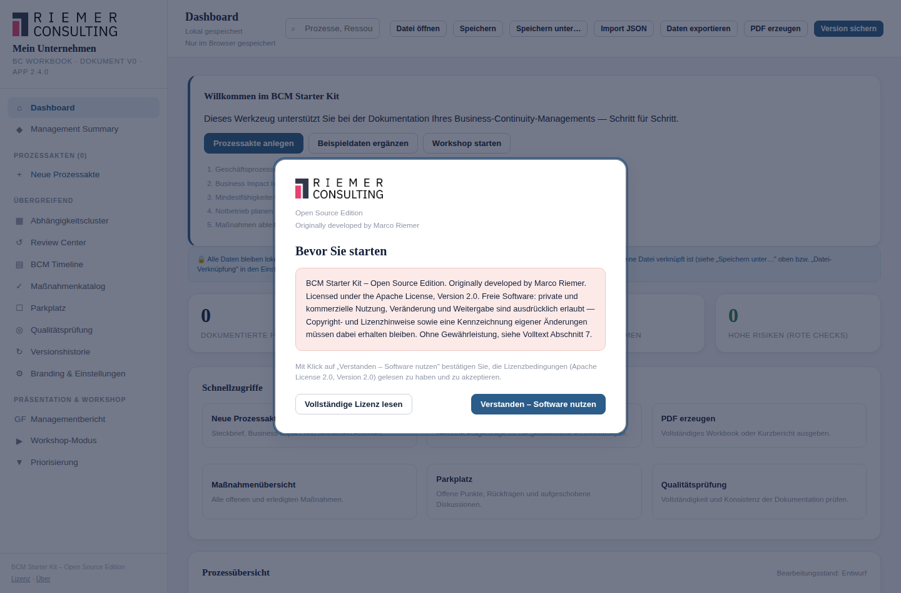

# 3. Bedienkonzept und Navigation

## Der Startbildschirm

Beim allerersten Öffnen zeigt das Starter Kit einen kurzen Lizenzhinweis.
Erst nach Bestätigung ("Verstanden – Software nutzen") ist die Anwendung
nutzbar. Das erscheint nur einmal pro Browser — danach startet die
Anwendung direkt auf dem Dashboard.

## Aufbau der Anwendung

Die Anwendung ist in drei feste Bereiche gegliedert:

- **Seitenleiste (links):** die Hauptnavigation. Oben Ihr
  Unternehmensname und die Versionsangabe, darunter alle Prozessakten,
  darunter übergreifende Bereiche (Abhängigkeitscluster, Review Center,
  BCM Timeline, Maßnahmenkatalog, Parkplatz, Qualitätsprüfung,
  Versionshistorie, Einstellungen), und ganz unten die
  Präsentations-/Workshop-Funktionen.
- **Obere Leiste:** zeigt den Titel der aktuellen Ansicht, den
  Speicherstatus, eine Volltextsuche über Prozesse, Ressourcen und
  Maßnahmen, sowie die immer verfügbaren Aktionen Import/Export, PDF
  erzeugen und Version sichern.
- **Hauptbereich:** der Inhalt der jeweils gewählten Ansicht.

## Prozessakten in der Seitenleiste

Jeder erfasste Prozess erscheint als eigener Eintrag mit einem farbigen
Punkt (rot = als kritisch eingestuft) und einem Fortschrittsbalken. Ein
Klick öffnet die Prozessakte im zuletzt verwendeten Reiter. Bei vielen
Prozessen zeigt die Seitenleiste zunächst nur die ersten acht und bietet
"… weitere anzeigen" an.

## Übergreifende Bereiche

Diese betreffen nicht nur einen einzelnen Prozess, sondern das gesamte
Workbook:

| Bereich | Zweck |
|---|---|
| Abhängigkeitscluster | zeigt, wie Prozesse über gemeinsame Ressourcen und Abhängigkeiten zusammenhängen (siehe [Kapitel 10](10-ressourcen-abhaengigkeiten.md)) |
| Review Center | überfällige/bald fällige Reviews, "was ist als Nächstes zu tun" (siehe [Kapitel 17](17-review-center.md)) |
| BCM Timeline | chronologische Ereignisübersicht (siehe [Kapitel 20](20-timeline.md)) |
| Maßnahmenkatalog | alle Maßnahmen workbook-weit (siehe [Kapitel 15](15-massnahmenmanagement.md)) |
| Parkplatz | offene, noch nicht eingeordnete Punkte (siehe [Kapitel 14](14-parkplatz.md)) |
| Qualitätsprüfung | Hinweise auf unvollständige oder widersprüchliche Angaben (siehe [Kapitel 16](16-qualitaetspruefung.md)) |
| Versionshistorie | gespeicherte Versionen und Vergleiche (siehe [Kapitel 23](23-versionierung.md)) |
| Branding & Einstellungen | Unternehmensangaben, Datei-Verknüpfung, Datensicherung (siehe [Kapitel 28](28-einstellungen.md)) |

Das **Dashboard** (Startansicht) selbst ist ebenfalls übergreifend: Es
zeigt zuerst das Governance Dashboard mit der priorisierten Aufgabenliste
(siehe [Kapitel 21](21-governance-dashboard.md)), darunter allgemeine
Kennzahlen.

## Präsentationsmodi

Drei Funktionen legen sich als Vollbild über die gesamte Anwendung — für
Situationen, in denen Sie etwas vorführen oder gemeinsam erarbeiten, ohne
die übrige Bedienoberfläche zu zeigen:

- **Managementbericht (GF-Ansicht)** — kompakte Entscheidungsvorlage für
  die Geschäftsführung (siehe [Kapitel 22](22-management-summary-gf-ansicht.md)).
- **Workshop-Modus** — geführte Fragenfolge für einen Workshop-Termin
  (siehe [Kapitel 13](13-workshop.md)).
- **Priorisierung** — beamertaugliche Übersicht aller Prozesse, sortiert
  nach BIA-Score, für die gemeinsame Diskussion, welcher Prozess zuerst
  behandelt wird.

Alle drei schließen Sie mit der **Escape**-Taste oder dem Schließen-Knopf
und kehren dann genau dorthin zurück, wo Sie vorher waren.

## Suche

Das Suchfeld in der oberen Leiste durchsucht Prozesse, Ressourcen und
Maßnahmen gleichzeitig nach Namen und wichtigen Feldern. Ein Klick auf
einen Treffer öffnet die passende Ansicht direkt an der richtigen Stelle.

## Speicherstatus

Unter dem Ansichtstitel zeigt die obere Leiste jederzeit, ob Ihre letzte
Änderung bereits gesichert ist, und — falls Sie eine Datei verknüpft haben
— mit welcher Datei. Näheres dazu in [Kapitel 4](04-workbook.md).

## Bedienung mit der Tastatur

Alle klickbaren Elemente sind über die Tabulatortaste erreichbar,
Dialoge fangen den Fokus, bis Sie sie schließen, und **Escape** schließt
jeden geöffneten Dialog bzw. jede geöffnete Vollbildansicht. Über
**Strg+K** öffnet sich eine schnelle Befehlspalette, mit der Sie viele
Funktionen ohne Maus erreichen.

## Verwandte Kapitel

- [Workbook erstellen, öffnen und sichern](04-workbook.md)
- [Prozesse erfassen und pflegen](05-prozesse.md)
