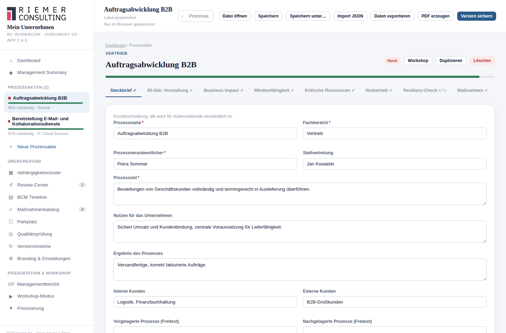

# 5. Prozesse erfassen und pflegen

## Wofür ist eine Prozessakte da?

Eine Prozessakte bündelt alles zu einem Geschäftsprozess: Steckbrief,
Auswirkungsanalyse, Ressourcen, Notbetriebsplanung, Resilienz-Check und
Maßnahmen. Sie ist die zentrale Arbeitseinheit im Starter Kit — fast alles
andere (Reviews, Timeline, Governance Dashboard, Freigabe) bezieht sich
auf einen oder mehrere Prozesse.

## Eine neue Prozessakte anlegen

Klicken Sie in der Seitenleiste auf **+ Neue Prozessakte**, vergeben Sie
einen Namen und bestätigen Sie. Die Akte ist sofort vollständig
angelegt — mit leeren Feldern in allen acht Reitern. Sie können ab jetzt
jederzeit zwischen den Reitern wechseln und in beliebiger Reihenfolge
ausfüllen.

## Die acht Reiter im Überblick

| Reiter | Inhalt | Kapitel |
|---|---|---|
| Steckbrief | Grunddaten, Kritikalität, Zeitwerte, Abhängigkeiten | dieses Kapitel, [6](06-kritikalitaet.md), [8](08-mta-rto-rpo.md) |
| 60-Sek.-Vorstellung | kurze Zusammenfassung für Workshops | dieses Kapitel |
| Business Impact | Auswirkungsanalyse (BIA) | [7](07-bia.md) |
| Mindestfähigkeit | was im Notbetrieb mindestens funktionieren muss | [9](09-mindestfaehigkeit.md) |
| Kritische Ressourcen | benötigte Personen, Systeme, Daten, Lieferanten | [10](10-ressourcen-abhaengigkeiten.md) |
| Notbetrieb | Ablauf im Ernstfall | [11](11-notbetrieb.md) |
| Resilienz-Check | 12-Punkte-Checkliste | [12](12-resilienz.md) |
| Maßnahmen | prozessbezogene Maßnahmen, Reviewhistorie, Reviewzyklen | [15](15-massnahmenmanagement.md), [18](18-reviewzyklen.md) |

## Der Steckbrief

Der Steckbrief ist der einzige Reiter mit echten Pflichtfeldern
(Prozessname, Fachbereich, Verantwortlicher, Ziel, Kritikalität, MTA) —
sie sind für die Fortschrittsanzeige und für eine spätere Freigabe
relevant.

**So gehen Sie vor:**

1. **Grunddaten** — Name, Fachbereich, Verantwortlicher, optional eine
   Stellvertretung.
2. **Beschreibung** — Ziel des Prozesses (Pflicht), Nutzen für das
   Unternehmen, Ergebnis des Prozesses.
3. **Kunden und Zusammenhang** — interne/externe Kunden sowie
   vor-/nachgelagerte Prozesse als Freitext. Für eine belastbare,
   auswertbare Verknüpfung nutzen Sie stattdessen die **strukturierten
   Abhängigkeiten** weiter unten auf demselben Reiter.
4. **Kritikalität & Zeitwerte** — Kritikalitätseinstufung sowie MTA, RTO
   und RPO (siehe [Kapitel 6](06-kritikalitaet.md) und
   [Kapitel 8](08-mta-rto-rpo.md)).

## Strukturierte Abhängigkeiten

Zusätzlich zu den Freitextfeldern "Vorgelagerte/nachgelagerte Prozesse"
können Sie eine **formale Abhängigkeit** zu einem anderen, bereits
angelegten Prozess herstellen — mit Richtung (vorgelagert/nachgelagert)
und einer eigenen Kritikalitätseinstufung der Abhängigkeit selbst.

**Was das bringt, was Freitext nicht kann:** Eine formale Abhängigkeit
bleibt bestehen, auch wenn Sie den anderen Prozess später umbenennen —
sie verweist auf den Prozess selbst, nicht auf seinen Namen. Erst formale
Abhängigkeiten ermöglichen außerdem den
[Abhängigkeitscluster](10-ressourcen-abhaengigkeiten.md): eine
Übersicht, wie stark Prozesse tatsächlich vernetzt sind, wo Ketten über
mehrere Prozesse laufen, und wo sich widersprüchliche Angaben ergeben
(z. B. wenn zwei Prozesse sich gegenseitig als vorgelagert eintragen).

Löschen Sie einen Prozess, mit dem eine formale Abhängigkeit bestand, wird
das beim betroffenen Prozess sichtbar angezeigt statt stillschweigend
ignoriert.

## Die 60-Sekunden-Vorstellung

Ein eigener, bewusst kurzer Reiter für eine Zusammenfassung, die sich
laut vorlesen lässt — gedacht für Workshops, in denen ein
Prozessverantwortlicher seinen Prozess in einer Minute vorstellt:

- Welchen Nutzen erzeugt der Prozess?
- Wie läuft er im Normalbetrieb?
- Warum wird er kritisch?
- Was passiert bei Ausfall?
- Was wird unbedingt benötigt?
- Wie sieht der heutige Notbetrieb aus (falls schon vorhanden)?

Diese Felder fließen auch in den Workshop-Modus ein (siehe
[Kapitel 13](13-workshop.md)) und werden im PDF-Bericht besonders
prominent dargestellt.

## Die Fortschrittsanzeige

Der Balken unter jedem Prozessnamen in der Seitenleiste zeigt, wie
vollständig die Akte bereits ist — gemittelt über alle acht Reiter. Er
ist eine **Orientierungshilfe für die Erhebung**, keine fachliche
Bewertung: Ein Prozess kann zu 100 % ausgefüllt und trotzdem fachlich
riskant sein (z. B. eine kritische Ressource ohne Alternative), und
umgekehrt ist ein zu 40 % ausgefüllter Prozess nicht automatisch
"schlecht" — er ist einfach noch nicht fertig erhoben.

**Achtung bei der Business-Impact-Bewertung:** Direkt nach dem Anlegen
zeigt der BIA-Reiter bereits eine Bewertung ("Mittel") an, obwohl der
Fortschritt für diesen Reiter noch 0 % meldet. Das ist kein Widerspruch,
sondern Absicht: Der angezeigte Wert ist ein neutraler Ausgangswert, noch
keine bestätigte Einschätzung. Erst wenn Sie zu einer Kategorie tatsächlich
eine Beschreibung eintragen, zählt sie als bearbeitet. Näheres in
[Kapitel 7](07-bia.md).

## Eine Prozessakte duplizieren

Über den Knopf **Duplizieren** im Kopfbereich der Prozessakte (neben
"Workshop" und "Löschen") legen Sie eine vollständige Kopie der aktuellen
Prozessakte als neue Akte an — mit dem Namenszusatz "(Kopie)" und allen
Inhalten aller acht Reiter (Steckbrief, BIA, Mindestfähigkeit, Notbetrieb,
Resilienz-Check, Maßnahmen usw.).

**Wichtig:** Die Verknüpfungen zu kritischen Ressourcen werden dabei
bewusst **nicht** mitkopiert — sonst würde dieselbe Ressource (z. B. ein
IT-System) doppelt gezählt, obwohl sie tatsächlich nur einmal existiert.
Prüfen Sie nach dem Duplizieren daher insbesondere:

- den Prozessnamen (statt "… (Kopie)" einen aussagekräftigen Namen
  vergeben),
- den Reiter **Kritische Ressourcen** — hier müssen Sie die tatsächlich
  benötigten Ressourcen erneut verknüpfen (siehe
  [Kapitel 10](10-ressourcen-abhaengigkeiten.md)),
- ob Verantwortlichkeit, Kritikalität und Zeitwerte für den neuen Prozess
  noch zutreffen, oder ob es sich tatsächlich um einen eigenständig zu
  bewertenden Prozess handelt.

Ein Duplikat eignet sich besonders, wenn mehrere Prozesse sehr ähnlich
aufgebaut sind (z. B. dieselbe Grundstruktur an mehreren Standorten) und
Sie sich das erneute Ausfüllen aller Reiter ersparen möchten.

## Löschen einer Prozessakte

Über den Knopf "Löschen" im Kopfbereich der Prozessakte können Sie einen
Prozess löschen. Das entfernt auch seine Ressourcen-Verknüpfungen sowie
Reviews und Maßnahmen, die ausschließlich zu ihm gehörten — sichern Sie
vorher eine Version, falls Sie das rückgängig machen können wollen
(siehe [Kapitel 23](23-versionierung.md)).

## Verwandte Kapitel

- [Kritikalität verstehen und dokumentieren](06-kritikalitaet.md)
- [Business Impact Analysis (BIA)](07-bia.md)
- [Ressourcen und Abhängigkeiten](10-ressourcen-abhaengigkeiten.md)
