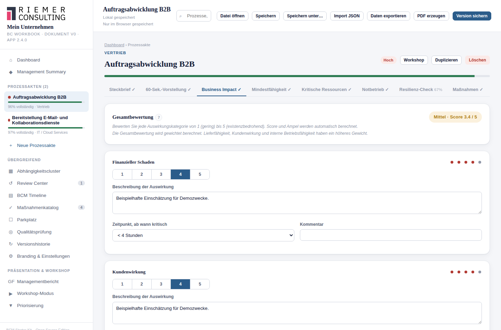

# 7. Business Impact Analysis (BIA)

## Wofür ist diese Funktion da?

Hier dokumentieren Sie, welche Auswirkungen ein Ausfall des Prozesses auf
verschiedene Bereiche Ihres Unternehmens hätte — und wie sich diese
Auswirkung mit der Zeit verschärft. Die BIA ist die fachliche Grundlage
für die Kritikalitätseinstufung (siehe [Kapitel 6](06-kritikalitaet.md))
und für die maximal tolerierbare Ausfallzeit (siehe
[Kapitel 8](08-mta-rto-rpo.md)).

## Wo finde ich sie?

Im Reiter **Business Impact** jeder Prozessakte.

## Die acht Auswirkungskategorien

| Kategorie | Leitfrage |
|---|---|
| Finanzieller Schaden | Welcher wirtschaftliche Schaden entsteht? |
| Kundenwirkung | Wie stark sind Kunden betroffen? |
| Lieferfähigkeit | Kann noch geliefert/geleistet werden? |
| Rechtliche/regulatorische Folgen | Drohen Verstöße, Bußgelder, Vertragsstrafen? |
| Reputationsschaden | Wie wirkt sich ein Ausfall auf das Ansehen aus? |
| Interne Betriebsfähigkeit | Wie stark sind andere interne Abläufe betroffen? |
| Mitarbeiterauswirkung | Wie stark sind Mitarbeitende betroffen? |
| Sicherheitsauswirkung | Entstehen Sicherheitsrisiken für Personen oder Anlagen? |

## So gehen Sie vor

Für jede Kategorie:

1. **Bewerten** Sie die Auswirkung auf einer Skala von 1 (gering) bis 5
   (existenzbedrohend).
2. **Beschreiben** Sie kurz, worin die Auswirkung konkret besteht. Das ist
   der wichtigste Schritt: Eine reine Zahl ohne Begründung ist für einen
   späteren Review oder für Kolleginnen und Kollegen kaum nachvollziehbar.
3. **Zeitpunkt**: ab wann diese Auswirkung eintritt (sofort, nach 4/24/72
   Stunden, oder später).
4. Optional ein **Kommentar**.

## Was das Starter Kit automatisch macht

Aus allen acht Bewertungen berechnet das Starter Kit einen **gewichteten
Gesamtscore** (Lieferfähigkeit, Kundenwirkung und interne
Betriebsfähigkeit zählen etwas stärker als die übrigen Kategorien) und
zeigt ihn oben im Reiter als Badge, z. B. "Mittel · Score 3.0 / 5". Aus
diesem Score leitet sich außerdem die Kritikalitäts-**Empfehlung** ab
(siehe [Kapitel 6](06-kritikalitaet.md)).

## Wichtig: Ausgangswert ist keine Einschätzung

Jede Kategorie startet technisch mit dem Wert 3 und dem Zeitpunkt
"< 4 Stunden" vorbelegt, damit die Bewertungsskala von Anfang an
bedienbar ist. **Das ist noch keine fachliche Einschätzung.** Solange Sie
zu einer Kategorie keine Beschreibung eingetragen haben, weist das
Starter Kit im Reiter ausdrücklich darauf hin ("Ausgangswert, noch nicht
bestätigt") — auch wenn der berechnete Gesamtscore oben bereits eine Zahl
zeigt. Erst eine eingetragene Beschreibung macht aus dem Ausgangswert
eine dokumentierte Einschätzung.

## Was ich selbst entscheiden muss

Ob eine Auswirkung tatsächlich als hoch oder niedrig zu bewerten ist,
entscheiden ausschließlich Sie. Das Starter Kit unterstützt bei Struktur
und Berechnung, trifft aber keine fachliche Aussage darüber, ob Ihre
Einschätzung richtig ist.

## Beispiel aus der Praxis

Prozess "Warenausgang": Bei der Kategorie Lieferfähigkeit könnte die
Bewertung "4" lauten, mit der Beschreibung "Nach 24 Stunden Ausfall
können vereinbarte Liefertermine für Großkunden nicht mehr eingehalten
werden", Zeitpunkt "< 24 Stunden". Diese Kombination aus Zahl und
Beschreibung macht die Einschätzung für einen späteren Review durch eine
andere Person nachvollziehbar — die reine Zahl "4" allein nicht.

## Typische Fehler

- Nur die Zahlen setzen und die Beschreibung leer lassen — der
  Gesamtscore wirkt dann vollständig, ist aber fachlich nicht belastbar.
- Alle Kategorien gleich hoch bewerten, ohne zu differenzieren. Ein
  Prozess ist selten in jeder Kategorie gleichermaßen betroffen.

## Verwandte Kapitel

- [Kritikalität verstehen und dokumentieren](06-kritikalitaet.md)
- [MTA, RTO und RPO](08-mta-rto-rpo.md)
- [Reviewzyklen](18-reviewzyklen.md) — eine BIA veraltet mit der Zeit
