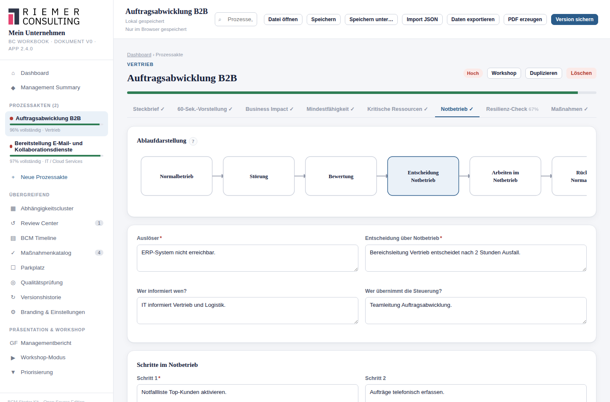

# 11. Notbetrieb

## Wofür ist diese Funktion da?

Der Notbetrieb beschreibt konkret, wie der Prozess während einer Störung
tatsächlich weiterläuft — wer was tut, mit welchen Unterlagen, und wie es
wieder zurück in den Normalbetrieb geht. Während die Mindestfähigkeit
(siehe [Kapitel 9](09-mindestfaehigkeit.md)) festlegt, *was* unverzichtbar
ist, beschreibt der Notbetrieb den *Ablauf*, wie dieser Mindestbetrieb in
der Praxis funktioniert.

## Wo finde ich ihn?

Im Reiter **Notbetrieb** jeder Prozessakte.

## Das Ablaufdiagramm

Oben im Reiter zeigt das Starter Kit eine feste Übersicht der sechs
Phasen einer Störung: Normalbetrieb → Störung → Bewertung → Entscheidung
Notbetrieb → Arbeiten im Notbetrieb → Rückkehr Normalbetrieb. Es ist eine
Orientierungshilfe, keine editierbare Grafik.

## So gehe ich vor

### 1. Auslöser und Entscheidung

- **Auslöser** — woran erkennt man, dass eine Störung vorliegt?
- **Entscheidung über Notbetrieb** — wer entscheidet, dass in den
  Notbetrieb gewechselt wird?
- **Wer informiert wen?** und **Wer übernimmt die Steuerung?**

### 2. Die Schritte im Notbetrieb

Bis zu vier konkrete Schritte, die im Ernstfall der Reihe nach
abgearbeitet werden (Schritt 1 ist Pflicht, die übrigen optional).

### 3. Was wird benötigt?

- **Benötigte Unterlagen**
- **Benötigte Kontaktlisten**
- **Benötigte Offline-Dokumente** — wichtig für Prozesse, die im
  Ernstfall ohne IT-Zugriff auskommen müssen.

### 4. Rückkehr und offene Lücken

- **Rückkehr in den Normalbetrieb** — wie wird erkannt und organisiert,
  dass wieder normal gearbeitet werden kann?
- **Offene Lücken** — was ist heute noch ungelöst? Ehrlich dokumentierte
  Lücken sind wertvoller als ein geschönter Plan.

### 5. Test des Notbetriebs

Tragen Sie ein, wann der Notbetrieb zuletzt tatsächlich getestet wurde.
Fehlt dieses Datum, weist das Starter Kit in der Managementsicht darauf
hin — ein ungetesteter Notbetriebsplan ist ein Risiko, das leicht
übersehen wird.

## Was das Starter Kit automatisch macht

Es prüft, ob überhaupt ein Notbetrieb dokumentiert ist, und markiert
fehlende Testdaten als Datenqualitätshinweis. Für **kritische** Prozesse
ohne dokumentierten Notbetrieb verweigert das Starter Kit außerdem eine
Freigabe (siehe [Kapitel 24](24-freigabe.md)).

## Was ich selbst entscheiden muss

Ob der beschriebene Ablauf im Ernstfall tatsächlich funktioniert, lässt
sich nur durch eine echte Übung oder einen echten Test klären — das
Starter Kit kann das nicht simulieren.

## Beispiel aus der Praxis

Prozess "Warenausgang": Auslöser "Auftragssystem nicht erreichbar länger
als 30 Minuten". Schritt 1: "Wechsel auf manuelle Auftragserfassung mit
Papierformular". Schritt 2: "Versand priorisiert nach Top-Kunden-Liste".
Benötigte Offline-Dokumente: "Aktuelle Top-Kunden-Liste als Ausdruck,
wöchentlich aktualisiert". Zuletzt getestet am: (noch offen) — als
offene Lücke vermerkt.

## Typische Fehler

- Einen Notbetrieb beschreiben, der nie geübt wurde, und ihn trotzdem als
  vollständig behandeln.
- Offline-Unterlagen als "vorhanden" voraussetzen, ohne zu prüfen, ob sie
  wirklich aktuell und tatsächlich offline verfügbar sind.

## Verwandte Kapitel

- [Mindestfähigkeit](09-mindestfaehigkeit.md)
- [Resilienz-Check](12-resilienz.md)
- [Freigabe und Release Readiness](24-freigabe.md)
