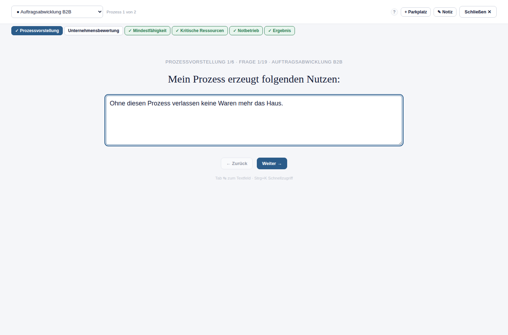

# 13. Workshop-Modus

## Wofür ist diese Funktion da?

Der Workshop-Modus führt eine Gruppe (typischerweise Prozessverantwortliche
und Moderator gemeinsam am Bildschirm) durch eine feste Fragenfolge — in
großer, gut lesbarer Schrift, ohne dass jemand die normalen
Prozessakten-Reiter einzeln ansteuern muss. Er eignet sich besonders für
die Ersterhebung eines Prozesses in einem gemeinsamen Termin.

## Wo finde ich ihn?

Über **Workshop starten** in der Seitenleiste, im Startbildschirm oder im
Prozesskontextmenü (dort direkt für den jeweiligen Prozess).

## So gehe ich vor

### Die sechs Themenblöcke

Der Workshop ist in sechs Blöcke gegliedert, die als Reiter oben in der
Ansicht erscheinen: **Prozessvorstellung, Unternehmensbewertung,
Mindestfähigkeit, Kritische Ressourcen, Notbetrieb, Ergebnis**. Ein
grüner Haken markiert einen vollständig beantworteten Block; Sie können
jederzeit direkt zu einem Block springen, statt streng der Reihe nach
vorzugehen.

### Fragen beantworten

Zu jeder Frage gibt es ein großes Antwortfeld. Ihre Eingabe wird direkt
in das zugehörige Feld der Prozessakte übernommen — es handelt sich also
nicht um eine separate Workshop-Datenbank, sondern um dieselben Felder,
die Sie auch in den normalen Reitern (Steckbrief, 60-Sek.-Vorstellung,
Mindestfähigkeit, Notbetrieb) sehen.

### Zwischen Prozessen wechseln

Über die Auswahlliste oben können Sie während der Sitzung den Prozess
wechseln — praktisch, wenn in einem Termin mehrere Prozesse besprochen
werden. Ein Punkt-Symbol zeigt den Bearbeitungsstand jedes Prozesses
(● weit fortgeschritten, ○ begonnen, leer noch nicht begonnen).

### Parkplatz-Punkte

Kommt während des Workshops ein Thema auf, das gerade nicht vertieft
werden soll, legen Sie es über **+ Parkplatz** direkt als offenen Punkt
an — ohne den Workshop zu unterbrechen (siehe
[Kapitel 14](14-parkplatz.md)).

### Moderatoren-Notiz

Über **✎ Notiz** öffnet sich ein Feld für persönliche Notizen der
Moderation. **Wichtig:** Diese Notiz wird bewusst **nicht gespeichert** —
sie ist ausschließlich für die Dauer der Sitzung gedacht und verschwindet
beim Schließen des Workshops vollständig, auch nicht im Export oder PDF.
Alles, was dauerhaft festgehalten werden soll, gehört in ein reguläres
Feld oder auf den Parkplatz.

### Abschluss-Check

Nach der letzten Frage des letzten Prozesses gelangen Sie zum
**Abschluss-Check**: einer Übersicht mit Bearbeitungsstand je Prozess
(Workshop-Fragen und Gesamtdokumentation getrennt ausgewiesen), allen noch
offenen Parkplatz-Punkten und einer Kurzfassung der Qualitätsprüfung
(siehe [Kapitel 16](16-qualitaetspruefung.md)).

## Was das Starter Kit automatisch macht

Es berechnet für jeden Block und jeden Prozess automatisch den
Bearbeitungsstand aus den ausgefüllten Feldern — es bewertet dabei nicht
die inhaltliche Qualität der Antworten, sondern nur, ob überhaupt etwas
eingetragen wurde.

## Was ich selbst entscheiden muss

Ob die Gruppe zu jeder Frage tatsächlich eine belastbare, gemeinsam
getragene Antwort gefunden hat — das Starter Kit zählt nur ausgefüllte
Felder, es bewertet keine Antwortqualität.

## Beispiel aus der Praxis

Im Workshop zum Prozess "Warenausgang" beantwortet das Team gemeinsam die
Frage "Was ist der erste Schritt im Notbetrieb?" mit "Wechsel auf manuelle
Auftragserfassung mit Papierformular". Eine offene Detailfrage zur
Lagerorganisation, die nicht sofort geklärt werden kann, wird über
"+ Parkplatz" festgehalten, statt die Sitzung zu verzögern.

## Typische Fehler

- Wichtige Zwischenergebnisse ausschließlich in der Moderatoren-Notiz
  festhalten — sie geht beim Schließen verloren.
- Den Workshop als reine Pflichtübung durchklicken, ohne dass die Gruppe
  tatsächlich diskutiert.

## Verwandte Kapitel

- [Prozesse erfassen und pflegen](05-prozesse.md)
- [Parkplatz](14-parkplatz.md)
- [Qualitäts- und Konsistenzprüfung](16-qualitaetspruefung.md)
