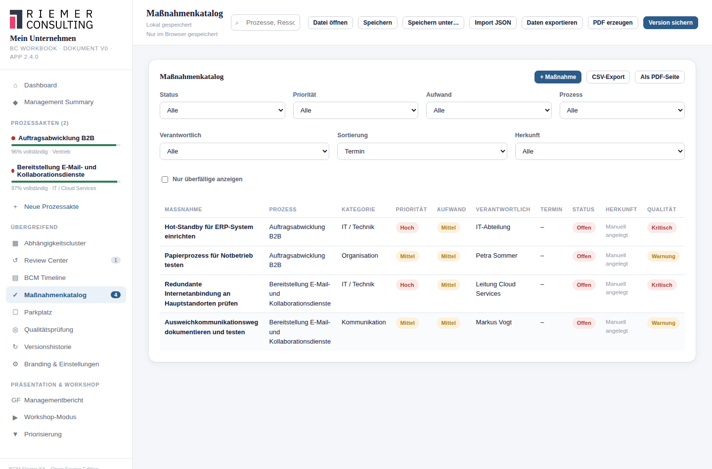

# 15. Maßnahmenmanagement

## Wofür ist diese Funktion da?

Maßnahmen sind die konkreten Aufgaben, mit denen erkannte Lücken
geschlossen werden — ob aus einem roten Resilienz-Check, einem Review,
einem Parkplatz-Punkt, einem Qualitätsbefund oder ganz einfach manuell
angelegt. Das Maßnahmenmanagement verfolgt jede Maßnahme von der
Entscheidung über die Umsetzung bis zum Wirksamkeitsnachweis.

## Wo finde ich es?

- **Maßnahmenkatalog** — eigener Menüpunkt in der Seitenleiste, zeigt
  alle Maßnahmen prozessübergreifend.
- **Reiter "Maßnahmen"** jeder Prozessakte — zeigt nur die Maßnahmen des
  jeweiligen Prozesses, zusammen mit dessen Reviewhistorie und
  Reviewzyklen-Einstellungen (siehe [Kapitel 18](18-reviewzyklen.md)).

## Eine Maßnahme anlegen

Über **+ Maßnahme** im Maßnahmenkatalog oder in einer Prozessakte. Eine
Maßnahme entsteht außerdem automatisch aus:

- einem in eine Maßnahme umgewandelten Parkplatz-Punkt (siehe
  [Kapitel 14](14-parkplatz.md)),
- einem roten oder gelben Resilienz-Check (siehe [Kapitel 12](12-resilienz.md)),
- einem Reviewbefund (siehe [Kapitel 17](17-review-center.md)),
- einem Befund der Qualitätsprüfung (siehe [Kapitel 16](16-qualitaetspruefung.md)).

In jedem Fall zeigt die Maßnahme eine **Herkunft** an (z. B. "Aus
Resilienz-Check"), die nicht nachträglich verändert werden kann — sie
dokumentiert ehrlich, wie die Maßnahme entstanden ist.

## Die Felder im Überblick

- **Grunddaten**: Prozessbezug, Kategorie, Priorität, Status,
  Verantwortlich, Termin.
- **Beschreibung**: erwarteter Nutzen, Bemerkung.
- **Aufwand & Nutzen/Aufwand-Matrix**: Aufwand, Kostenschätzung,
  Entscheidungsbedarf. Aus Priorität und Aufwand berechnet das Starter
  Kit automatisch eine Einordnung in die Nutzen/Aufwand-Matrix (z. B.
  "Schnell umsetzbar" bei hoher Priorität und niedrigem Aufwand).
- **Risikoeinschätzung**: Risiko ohne Maßnahme, Risiko nach Maßnahme —
  als Freitext, um die Wirkung der Maßnahme greifbar zu machen.
- **Genehmigung**: Genehmiger, Genehmigt am.
- **Wirksamkeitsprüfung**: Nachweis, Wirksamkeit geprüft am, Ergebnis,
  Prüfer, Wiedervorlage. Prüfer und Ergebnis sind bewusst getrennte
  Felder — "erledigt" bedeutet nicht automatisch "wirksam", und
  "wirksam" sagt allein noch nicht, wer das geprüft hat.

## Status einer Maßnahme

Offen, Geplant, In Arbeit, Blockiert, Erledigt, Verworfen,
Zurückgestellt. Setzen Sie den Status auf **Blockiert**, verlangt das
Starter Kit eine **Begründung für die Blockade** — eine blockierte
Maßnahme ohne Begründung wird im Katalog und im Governance Dashboard
(siehe [Kapitel 21](21-governance-dashboard.md)) sichtbar hervorgehoben.

## Was das Starter Kit automatisch macht

- Es setzt beim Wechsel auf "Erledigt" einmalig ein Abschlussdatum — und
  entfernt es nicht wieder automatisch, falls die Maßnahme später erneut
  geöffnet wird.
- Es markiert Maßnahmen als **überfällig**, wenn der Termin verstrichen
  ist, ohne dass die Maßnahme erledigt wurde.
- Es weist auf **fehlenden Wirksamkeitsnachweis** hin, wenn eine Maßnahme
  als erledigt markiert ist, aber weder Nachweis noch Prüfungsdatum
  hinterlegt sind.
- Es zeigt zu jeder Maßnahme automatisch die Befunde einer eingebauten
  Qualitätsprüfung an (z. B. fehlender Verantwortlicher), direkt unter
  der Maßnahme.

## Filtern und Sortieren

Im Maßnahmenkatalog lässt sich nach Status, Priorität, Prozess, Aufwand,
Verantwortlichem, Herkunft und "nur überfällige" filtern, sowie nach
Termin, Priorität, Aufwand oder Status sortieren.

## Was ich selbst entscheiden muss

Ob eine Maßnahme tatsächlich wirksam war, prüfen und beurteilen Sie — das
Starter Kit erinnert nur daran, dass eine Prüfung noch aussteht.

## Beispiel aus der Praxis

Aus dem roten Resilienz-Check "IT-Alternative vorhanden" (Prozess
Warenausgang) entsteht automatisch eine Maßnahme "IT-Alternative vorhanden
schaffen" mit Herkunft "Aus Resilienz-Check". Sie wird konkretisiert:
Verantwortlich IT-Leitung, Termin in drei Monaten, Aufwand hoch, Priorität
hoch. Nach Umsetzung: Nachweis "Testprotokoll vom 12.03.", Wirksamkeit
geprüft am 15.03., Ergebnis "Wirksam", Prüfer Prozessverantwortlicher.

## Typische Fehler

- Eine Maßnahme auf "Erledigt" setzen, ohne je die Wirksamkeit zu prüfen.
- Eine Maßnahme auf "Blockiert" setzen und die Begründung leer lassen.
- Maßnahmen ohne Termin oder Verantwortlichen anlegen — sie verschwinden
  dann faktisch aus der Nachverfolgung.

## Verwandte Kapitel

- [Parkplatz](14-parkplatz.md)
- [Review Center](17-review-center.md)
- [Governance Dashboard](21-governance-dashboard.md)

> Die zugrundeliegenden Datenfelder und Berechnungslogiken sind zusätzlich
> in der [technischen Referenz](../technical/massnahmenmanagement.md)
> dokumentiert.
