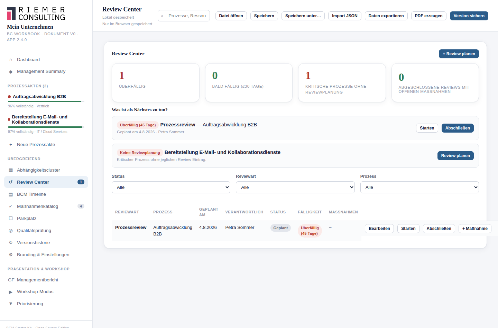

# 17. Review Center

## Wofür ist diese Funktion da?

Das Review Center beantwortet eine einzige, konkrete Frage: **Was muss
als Nächstes getan werden?** Statt Reviews in jeder Prozessakte einzeln
im Blick zu behalten, sehen Sie hier alle geplanten, laufenden und
überfälligen Reviews über alle Prozesse hinweg an einer Stelle.

## Wo finde ich es?

Als eigener Menüpunkt **Review Center** in der Seitenleiste.

## Die vier Reviewarten

Prozessreview, BIA-Review, Notbetriebsreview, Ressourcenreview — jede
Reviewart bezieht sich auf einen bestimmten Teil der Prozessakte und wird
unabhängig von den anderen geplant und durchgeführt.

## So gehe ich vor

### Einen Review planen

Über **+ Review planen** legen Sie einen neuen Review an: Prozess,
Reviewart, geplantes Datum, Verantwortlich. Der Review erhält den Status
**Geplant**.

### Einen Review starten

Über **Starten** wechselt der Review in den Status **In Bearbeitung** —
das eigentliche Startdatum wird dabei automatisch festgehalten.

### Einen Review abschließen

Über **Abschließen** öffnet sich ein Dialog: Sie tragen ein **Ergebnis**
ein (Pflichtfeld — Feststellungen, Entscheidung, Begründung) und
optional einen **nächsten Reviewtermin**. Ist für diese Reviewart eine
Zykluspolicy definiert (siehe [Kapitel 18](18-reviewzyklen.md)), schlägt
das Starter Kit den nächsten Termin automatisch vor und bietet an, den
Folgereview direkt als "Geplant" anzulegen — Sie können das jederzeit
abwählen.

### Aus einem Review eine Maßnahme anlegen

Über **Maßnahme anlegen** bei einem Review erstellen Sie direkt eine
verknüpfte Maßnahme (siehe [Kapitel 15](15-massnahmenmanagement.md)) —
praktisch, wenn ein Review eine Lücke aufdeckt, die konkret bearbeitet
werden muss.

## Was das Starter Kit automatisch macht

- Es berechnet die **Fälligkeit** jedes Reviews laufend aus dem geplanten
  Datum — überfällig, bald fällig (innerhalb von 30 Tagen) oder
  unauffällig. Diese Fälligkeit wird nicht gespeichert, sondern bei jeder
  Ansicht neu berechnet.
- Es zeigt oben eine Übersicht: überfällige Reviews, bald fällige
  Reviews, und **kritische Prozesse ganz ohne jegliche Reviewplanung** —
  ein Fall, der leicht übersehen wird, weil kein einzelner Review dafür
  "überfällig" sein kann.
- Es sortiert die priorisierte Liste immer nachvollziehbar: zuerst am
  längsten überfällige Reviews, dann die nächsten bald fälligen, dann
  kritische Prozesse ohne jede Planung.

## Was ich selbst entscheiden muss

Ob ein Review inhaltlich gründlich genug durchgeführt wurde, bewertet
allein die eintragende Person — das Starter Kit erzwingt nur, dass ein
Ergebnis überhaupt dokumentiert wird.

## Beispiel aus der Praxis

Der jährliche Prozessreview für "Warenausgang" wird mit Termin in drei
Monaten geplant. Bei Fälligkeit erscheint er im Review Center als "Bald
fällig". Nach Durchführung wird das Ergebnis eingetragen ("Prozess
weiterhin aktuell, Notbetrieb noch nicht getestet") und — dank
hinterlegter Jahrespolicy — automatisch ein Folgereview in zwölf Monaten
vorgeschlagen und angelegt.

## Typische Fehler

- Reviews planen, aber nie tatsächlich abschließen — die Fälligkeit läuft
  dann unbemerkt ins "Überfällig".
- Kritische Prozesse ganz ohne jede Reviewplanung belassen.

## Verwandte Kapitel

- [Reviewzyklen](18-reviewzyklen.md)
- [Reviews durchführen](19-reviews-durchfuehren.md)
- [Maßnahmenmanagement](15-massnahmenmanagement.md)

> Die zugrundeliegenden Datenfelder und Berechnungslogiken sind zusätzlich
> in der [technischen Referenz](../technical/review-center.md) dokumentiert.
