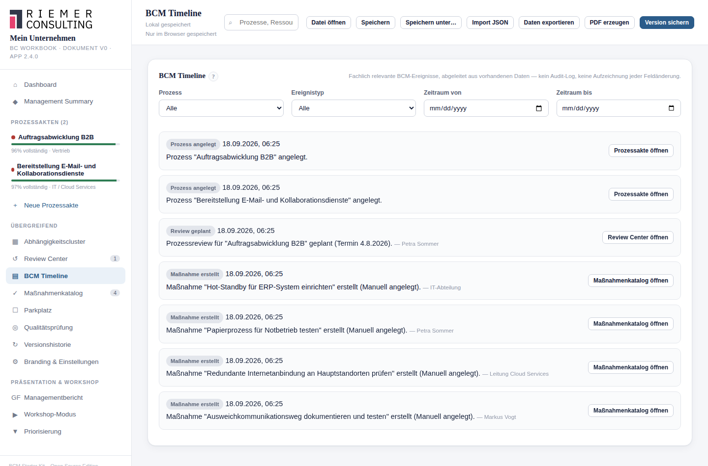

# 20. BCM Timeline

## Wofür ist diese Funktion da?

Die Timeline zeigt eine chronologische, filterbare Übersicht fachlich
relevanter BCM-Ereignisse — über alle Prozesse hinweg. Sie beantwortet
Fragen wie "Was ist in den letzten Monaten an diesem Prozess passiert?"
oder "Wann wurde die Kritikalität zuletzt geändert?".

## Wo finde ich sie?

Als eigener Menüpunkt **BCM Timeline** in der Seitenleiste. In der
Prozessakte (Reiter Maßnahmen) führt der Link "Timeline anzeigen"
direkt in die auf diesen Prozess gefilterte Ansicht.

## Wichtig: Kein Audit-Log

Die Timeline zeichnet **nicht jede Feldänderung** auf. Sie zeigt
ausschließlich fachlich bedeutsame Ereignisse, die sich aus bereits
vorhandenen Daten ableiten lassen — etwa:

- Prozess angelegt
- Review geplant / gestartet / abgeschlossen
- Maßnahme erstellt / abgeschlossen
- Wirksamkeit einer Maßnahme geprüft
- Kritikalität geändert
- MTA/RTO/RPO geändert
- Notbetrieb wesentlich geändert (nur die zentralen Felder — Auslöser,
  Entscheidung, die vier Schritte, Rückkehr — nicht jede kleine
  Formulierungsänderung)
- Kritische Ressourcen geändert
- Version gespeichert
- Freigabe erzeugt

Ein Ereignis erscheint nur, wenn dafür tatsächlich ein echter Zeitpunkt
vorliegt — ein nur geplanter Review erzeugt also ein einzelnes Ereignis,
nicht mehrere mit erfundenen Zwischendaten.

## So gehe ich vor

Filtern Sie nach **Prozess**, **Ereignistyp** und **Zeitraum**. Jeder
Eintrag zeigt Zeitpunkt, Beschreibung und, sofern bekannt, die
handelnde Person — sowie einen Direktlink in die zugehörige Ansicht
(Prozessakte, Review Center, Maßnahmenkatalog oder Versionshistorie).

## Was das Starter Kit automatisch macht

Es liest ausschließlich vorhandene Daten (Zeitstempel, Versionsvergleiche)
und erzeugt daraus die Liste — es speichert dabei selbst nichts Neues.
Änderungen an Feldern, für die es keinen eigenen Zeitstempel gibt (z. B.
der Wechsel einer Maßnahme auf "In Arbeit" oder "Blockiert"), erscheinen
bewusst **nicht** in der Timeline, da hierfür kein echter Zeitpunkt
gespeichert wird.

## Was ich selbst entscheiden muss

Die Timeline ist eine Lesehilfe zur Nachvollziehbarkeit, kein
Prüfnachweis für regulatorische Zwecke — für belastbare Nachweise nutzen
Sie die Versionshistorie und Freigabe (siehe
[Kapitel 23](23-versionierung.md) und [Kapitel 24](24-freigabe.md)).

## Beispiel aus der Praxis

Gefiltert auf den Prozess "Warenausgang" zeigt die Timeline: "Prozess
angelegt" (vor 14 Monaten), "Kritikalität geändert: Mittel → Hoch" (vor
6 Monaten), "Prozessreview abgeschlossen" (vor 2 Monaten), "Maßnahme
'IT-Alternative vorhanden schaffen' abgeschlossen" (vor 3 Wochen).

## Typische Fehler

- Die Timeline mit einem vollständigen Änderungsprotokoll verwechseln —
  sie zeigt bewusst nur eine Auswahl fachlich relevanter Ereignisse.
- Erwarten, dass jeder Statuswechsel einer Maßnahme einen Zeitstempel
  erzeugt — das gilt nur für die tatsächlich gespeicherten Zeitpunkte.

## Verwandte Kapitel

- [Review Center](17-review-center.md)
- [Maßnahmenmanagement](15-massnahmenmanagement.md)
- [Versionierung und Versionshistorie](23-versionierung.md)

> Die zugrundeliegenden Ableitungsregeln sind zusätzlich in der
> [technischen Referenz](../technical/timeline.md) dokumentiert.
