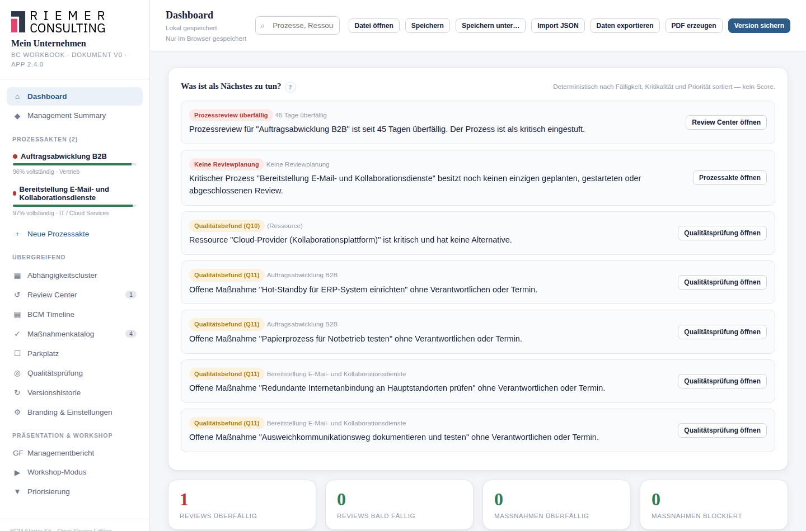

# 21. Governance Dashboard

## Wofür ist diese Funktion da?

Das Governance Dashboard beantwortet innerhalb weniger Sekunden die
Frage: **Worum sollte ich mich als BCM-Verantwortlicher jetzt kümmern?**
Es ist bewusst **kein** Managementbericht, kein Compliance-Nachweis, kein
Reifegradmodell und keine Risikobewertung — sondern eine reine
Arbeitsliste, zusammengestellt aus Informationen, die im Starter Kit
bereits an anderer Stelle vorhanden sind (Reviews, Maßnahmen,
Qualitätsprüfung, Freigaben).

## Wo finde ich es?

Es ist kein eigener Menüpunkt, sondern der obere Teil der Ansicht
**Dashboard** (Startbildschirm, ⌂-Symbol in der Seitenleiste) — direkt
oberhalb der allgemeinen Kennzahlenkacheln. Solange noch kein einziger
Prozess angelegt ist, erscheint stattdessen die gewohnte Willkommenskarte.

## Die priorisierte Aufgabenliste

Unter der Überschrift **"Was ist als Nächstes zu tun?"** zeigt das
Dashboard eine sortierte Liste konkreter Aufgaben — jede
mit einem nachvollziehbaren Grund (nie nur "Hohe Priorität", sondern
z. B. "14 Tage überfällig") und einem Direktlink in die passende Ansicht.
Die Reihenfolge ist fest und wird u. a. danach bestimmt:

1. Überfällige Reviews kritischer Prozesse
2. Überfällige Maßnahmen mit hoher Priorität
3. Blockierte Maßnahmen mit hoher Relevanz
4. Kritische Prozesse ganz ohne Reviewplanung
5. Bald fällige Reviews kritischer Prozesse
6. Erledigte Maßnahmen ohne Wirksamkeitsprüfung
7. Offener Managemententscheidungsbedarf
8. Wesentliche offene Qualitäts-/Konsistenzbefunde
9. Übrige überfällige Reviews und Maßnahmen
10. Übrige fällige Aufgaben (bald fällige Reviews, blockierte Maßnahmen
    ohne hohe Relevanz, fällige Wiedervorlagen)

Dieselben Daten ergeben immer dieselbe Reihenfolge — es steckt keine
Zufallslogik und keine "Künstliche Intelligenz" dahinter, sondern eine
feste, nachvollziehbare Abfolge von Filtern.

## Die Kennzahlenkacheln

Acht Kacheln fassen den Zustand kompakt zusammen: überfällige/bald
fällige Reviews, überfällige/blockierte Maßnahmen, offene
Wirksamkeitsprüfungen, kritische Prozesse ohne Reviewplanung, offene
Managemententscheidungen, Änderungen seit der letzten Freigabe. Jede Zahl
ist eine direkte Zählung — kein berechneter Reifegrad, kein Score.

## Die fünf Detailkarten

Unterhalb der Liste finden Sie kompakte Karten zu: Review-Governance,
Maßnahmen-Governance, Änderungen seit letzter Freigabe, offene
Managemententscheidungen, sowie Datenqualität & Konsistenz. Existiert
noch keine Freigabe, wird das offen so benannt — das Starter Kit erfindet
keinen Bezugszeitpunkt ("seit der ersten Version" o. Ä.).

## Was das Starter Kit automatisch macht

Alle Zahlen und Listen werden bei jedem Aufruf neu aus den vorhandenen
Daten berechnet — nichts davon wird zusätzlich gespeichert. Es gibt daher
auch keinen Fall, in dem das Dashboard "veraltete" Zahlen zeigt.

## Was ich selbst entscheiden muss

Die Reihenfolge zeigt, was aus Sicht fester Regeln dringlich ist — ob eine
Aufgabe tatsächlich zuerst bearbeitet werden sollte, bleibt eine
fachliche Abwägung.

## Beispiel aus der Praxis

Ganz oben in der Liste erscheint "Prozessreview überfällig — Warenausgang
(14 Tage überfällig, kritischer Prozess)" mit einem Link direkt ins
Review Center. Darunter: "Managemententscheidung offen — Budgetfreigabe
für Ersatzarbeitsplatz erforderlich."

## Typische Fehler

- Das Dashboard mit einer vollständigen Bestandsaufnahme verwechseln —
  es zeigt nur, was aus den festen Regeln eine Aufgabe ergibt.
- Eine leere Prioritätsliste als "BCM vollständig aktuell" missverstehen —
  sie bedeutet nur, dass aktuell keine der geprüften Bedingungen zutrifft.

## Verwandte Kapitel

- [Review Center](17-review-center.md)
- [Maßnahmenmanagement](15-massnahmenmanagement.md)
- [Qualitäts- und Konsistenzprüfung](16-qualitaetspruefung.md)
- [Management Summary und GF-Ansicht](22-management-summary-gf-ansicht.md)

> Die vollständige Priorisierungslogik ist zusätzlich in der
> [technischen Referenz](../technical/governance-dashboard.md) dokumentiert.
