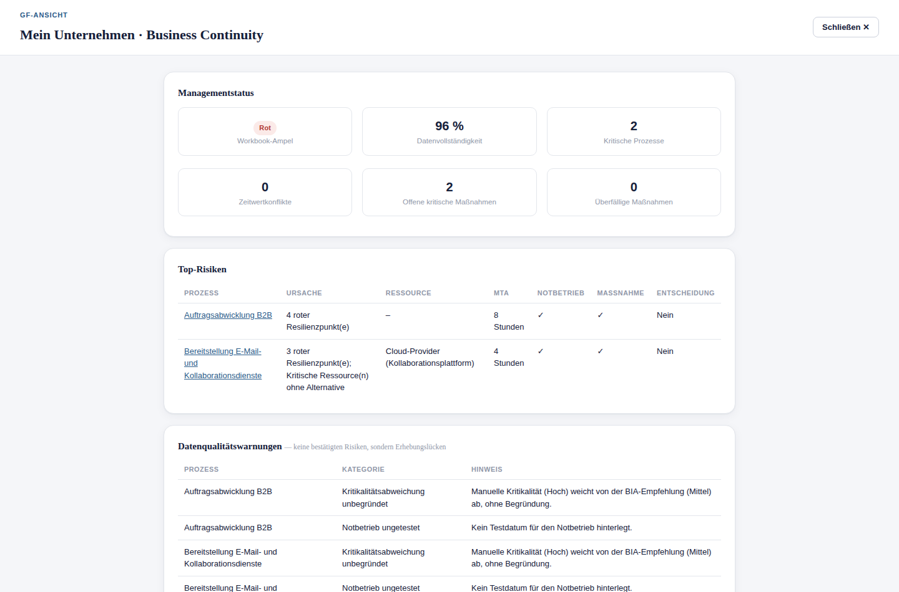

# 22. Management Summary und GF-Ansicht

## Wofür sind diese Funktionen da?

Beide Ansichten fassen den Stand des gesamten Business Continuity
Workbooks für eine Managementzielgruppe zusammen — ohne dass diese Person
selbst durch alle Prozessakten klicken muss. Sie teilen sich denselben
Inhalt, unterscheiden sich aber in Darstellung und Umfang.

## Wo finde ich sie?

- **Management Summary** — eigener Menüpunkt in der Seitenleiste, wird
  innerhalb der normalen Navigation angezeigt.
- **Managementbericht (GF-Ansicht)** — eigener Knopf in der Seitenleiste,
  öffnet sich als eigenständige Vollbildansicht (auch geeignet, um sie
  während einer Besprechung am Bildschirm zu zeigen).

## Der Managementstatus (oberster Bereich der GF-Ansicht)

Direkt beim Öffnen der GF-Ansicht sehen Sie zuerst den Bereich
**Managementstatus** — den kompaktesten Einstieg, noch vor allen anderen
Inhalten dieses Kapitels. Er beantwortet auf einen Blick: *Steht das
Workbook insgesamt gut da, und wo brennt es am meisten?*

### Die sechs Kennzahlenkacheln

| Kachel | Bedeutung |
|---|---|
| Workbook-Ampel | Gesamtampel über alle Prozesse (siehe [Kapitel 6](06-kritikalitaet.md)) |
| Datenvollständigkeit | wie weit die Prozessakten im Schnitt ausgefüllt sind |
| Kritische Prozesse | Anzahl als "Hoch" eingestufter Prozesse — anklickbar für die Liste |
| Zeitwertkonflikte | Anzahl Prozesse, bei denen RTO die MTA überschreitet (siehe [Kapitel 8](08-mta-rto-rpo.md)) — anklickbar für die Liste |
| Offene kritische Maßnahmen | offene Maßnahmen mit hoher Priorität — führt in den gefilterten Maßnahmenkatalog |
| Überfällige Maßnahmen | Maßnahmen mit verstrichenem Termin — führt in den gefilterten Maßnahmenkatalog |

### Die Tabelle "Top-Risiken"

Zeigt ausschließlich **kritische** Prozesse, bei denen mindestens eine
konkrete Ursache erkannt wurde (RTO über MTA, kein dokumentierter
Notbetrieb, roter Resilienzpunkt, oder eine kritische Ressource ohne
Alternative). Je Zeile: Prozess (verlinkt in die Prozessakte), Ursache,
betroffene Ressource, MTA, ob ein Notbetrieb hinterlegt ist, ob bereits
eine Maßnahme existiert, und ob eine Entscheidung erforderlich ist. Ist
für einen kritischen Prozess **keine** dieser Ursachen erkannt, erscheint
er hier bewusst nicht — die Tabelle zeigt nur bestätigte Risiken, keine
vollständige Prozessliste.

### Die Tabelle "Datenqualitätswarnungen"

Getrennt von den Top-Risiken ausgewiesen, weil es sich **nicht** um
bestätigte Risiken handelt, sondern um Erhebungslücken: fehlender
Prozessverantwortlicher, unbegründete Kritikalitätsabweichung,
unvollständige RTO/RPO-Angaben, ungetesteter Notbetrieb, oder eine
Abhängigkeit, die auf einen inzwischen gelöschten Prozess verweist.

### Herkunft und Interpretation

Beide Tabellen und alle sechs Kacheln werden bei jedem Öffnen der
GF-Ansicht neu aus den vorhandenen Prozess-, Ressourcen- und
Maßnahmendaten berechnet — dieselben Daten, die Sie auch im
[Governance Dashboard](21-governance-dashboard.md), im
[Maßnahmenkatalog](15-massnahmenmanagement.md) und in der
[Qualitätsprüfung](16-qualitaetspruefung.md) sehen, hier nur für die
Managementebene zusammengefasst dargestellt. Es wird nichts gespeichert
und keine neue Bewertung erfunden.

**Was das Starter Kit nicht automatisch entscheidet:** Ob eine "Rote"
Workbook-Ampel oder ein aufgeführtes Top-Risiko sofort gehandelt werden
muss, welche der Datenqualitätslücken zuerst geschlossen wird, und ob
eine Entscheidung im Sinne des Unternehmens getroffen wurde — das bleibt
in jedem Fall eine Managemententscheidung.

## Was beide Ansichten enthalten

- Eine kurze Textzusammenfassung: Anzahl Prozesse, davon kritisch, offene
  rote Resilienz-Risiken, offene Maßnahmen.
- **Kritischste Prozesse** (Top 5 nach BIA-Score) mit Kritikalität,
  BIA-Einstufung und MTA.
- **Entscheidungsbedarf** je Prozess.
- **Kritikalität vs. BIA-Empfehlung** — alle Prozesse, bei denen die
  manuelle Einstufung von der Empfehlung abweicht, mit Kennzeichnung, ob
  eine Begründung vorliegt (siehe [Kapitel 6](06-kritikalitaet.md)).
- **Prozessabhängigkeiten** — Prozesse mit den meisten Abhängigkeiten,
  mögliche Single Points of Failure, kritische mehrstufige Ketten.
- **Abhängigkeits-Warnungen** — Verweise auf gelöschte Prozesse,
  widersprüchliche gegenseitige Abhängigkeitsangaben.
- Top offene Maßnahmen nach Priorität.

## Was zusätzlich nur die GF-Ansicht zeigt

Die GF-Ansicht (Managementbericht) stellt vor dem übrigen Inhalt einen
kompakten Überblick voran:

- Eine **Gesamtampel** über alle Prozesse (Rot, sobald mindestens ein
  Prozess rot ist; Gelb, sobald mindestens ein Prozess gelb ist; sonst
  Grün).
- Die Liste der **roten Prozesse** mit den jeweiligen Gründen.
- **Offene Entscheidungen** — Prozesse, bei denen die
  Entscheidungslogik für den Notbetrieb noch nicht dokumentiert ist.

## Was das Starter Kit automatisch macht

Beide Ansichten berechnen ihren Inhalt bei jedem Aufruf neu aus den
vorhandenen Prozessdaten — es gibt keine separate, manuell zu pflegende
"Managementversion" der Daten.

## Was ich selbst entscheiden muss

Diese Ansichten fassen bestehende Informationen zusammen, treffen aber
keine eigene fachliche Bewertung darüber hinaus. Ob ein als "kritisch"
gezeigter Prozess tatsächlich Priorität braucht, bleibt eine
Managemententscheidung.

## Beispiel aus der Praxis

Vor einem Lenkungsausschuss öffnet der BCM-Verantwortliche die GF-Ansicht:
Gesamtampel Gelb, ein roter Prozess ("Warenausgang", Grund: "Single Point
of Failure ohne Alternative"), zwei offene Entscheidungen. Diese drei
Punkte bilden die Tagesordnung für den Termin.

## Typische Fehler

- Die GF-Ansicht mit einem vollständigen Prüfbericht verwechseln — sie
  ist eine Zusammenfassung, kein Ersatz für die Freigabeprüfung (siehe
  [Kapitel 24](24-freigabe.md)).

## Verwandte Kapitel

- [Kritikalität verstehen und dokumentieren](06-kritikalitaet.md)
- [Ressourcen und Abhängigkeiten](10-ressourcen-abhaengigkeiten.md)
- [Governance Dashboard](21-governance-dashboard.md)
