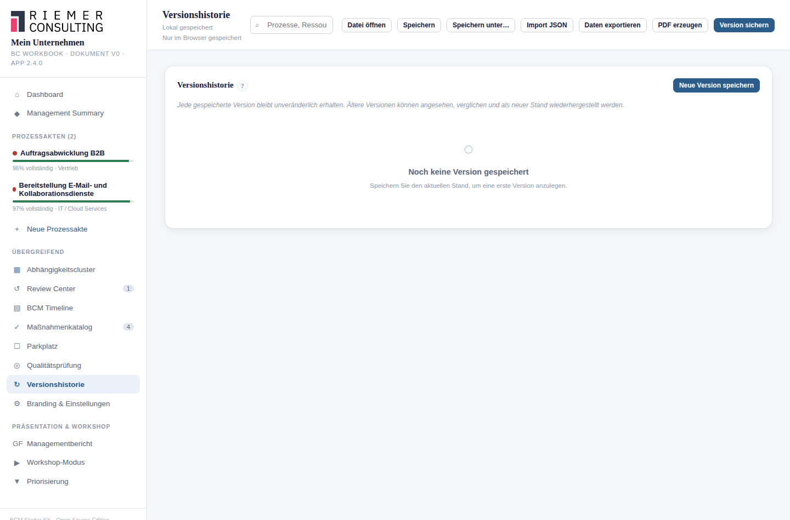

# 23. Versionierung und Versionshistorie

## Wofür ist diese Funktion da?

Eine Version ist ein unveränderlicher Schnappschuss des gesamten
Workbooks zu einem bestimmten Zeitpunkt. Damit lässt sich der Stand zu
einem früheren Zeitpunkt jederzeit ansehen, mit dem aktuellen Stand
vergleichen — oder bei Bedarf wiederherstellen.

## Wo finde ich sie?

Als eigener Menüpunkt **Versionshistorie** in der Seitenleiste. Über den
Topbar-Knopf **Version sichern** lässt sich außerdem jederzeit aus jeder
Ansicht heraus eine neue Version anlegen.

## So gehe ich vor

### Eine Version speichern

Über **Neue Version speichern** erfassen Sie Bearbeiter und optional eine
Notiz (z. B. "Nach Workshop mit Fachbereich Logistik"). Das Starter Kit
legt daraufhin einen vollständigen Schnappschuss des aktuellen Stands an.

### Eine Version ansehen

Über **Ansehen** öffnet sich eine kompakte Übersicht (Anzahl Prozesse,
davon kritisch, Anzahl Maßnahmen) sowie die hinterlegte Notiz.

### Zwei Versionen vergleichen

Wählen Sie zwei Versionen aus und klicken Sie **Vergleichen**. Das
Starter Kit zeigt strukturiert: neue/entfernte Prozesse, geänderte
Prozesse (mit den konkret geänderten Feldern), neue/entfernte Ressourcen
und geänderte Maßnahmen.

### Eine ältere Version wiederherstellen

Über **Wiederherstellen** wird der gewählte Stand zum aktuellen Stand.
**Wichtig:** Der bisherige aktuelle Stand wird dabei **nicht**
automatisch vorher gesichert — das Starter Kit weist ausdrücklich darauf
hin. Möchten Sie den aktuellen Stand behalten, speichern Sie vorher
selbst eine Version.

### Prüfsummen

Zu jeder Version zeigt das Starter Kit eine Prüfsummen-Markierung: "✓
geprüft" (Inhalt konnte verifiziert werden), "⚠ Abweichung", "historisch,
ungeprüft" (ältere Version ohne Prüfsummenverfahren) oder "nicht
prüfbar". Ein als beschädigt erkannter Schnappschuss ("Snapshot defekt")
lässt sich weder ansehen noch wiederherstellen — die übrigen Versionen
sind davon nicht betroffen.

## Was das Starter Kit automatisch macht

Es hält jede gespeicherte Version unveränderlich fest — auch eine spätere
Freigabe (siehe [Kapitel 24](24-freigabe.md)) ändert eine bereits
gespeicherte Version nicht rückwirkend. Es prüft Prüfsummen im
Hintergrund und aktualisiert die Anzeige.

## Was ich selbst entscheiden muss

Wann ein sinnvoller Zeitpunkt für eine Versionssicherung ist (z. B. vor
größeren Änderungen oder nach einem Workshop), entscheiden Sie. Das
Starter Kit legt keine automatischen Versionen an.

## Beispiel aus der Praxis

Vor dem Wiederherstellen eines älteren Stands, um versehentliche
Änderungen einer Kollegin/eines Kollegen rückgängig zu machen, wird
zunächst eine Version des aktuellen (fehlerhaften) Stands gespeichert —
damit dieser bei Bedarf ebenfalls wieder auffindbar bleibt.

## Typische Fehler

- Eine Version wiederherstellen, ohne vorher den aktuellen Stand zu
  sichern, und dabei ungewollt Änderungen verlieren.
- Versionen nie anlegen und sich ausschließlich auf den aktuellen Stand
  verlassen — ohne Versionshistorie lässt sich später nichts vergleichen.

## Verwandte Kapitel

- [Freigabe und Release Readiness](24-freigabe.md)
- [BCM Timeline](20-timeline.md)
- [Datensicherung und Wiederherstellung](26-datensicherung-recovery.md)
