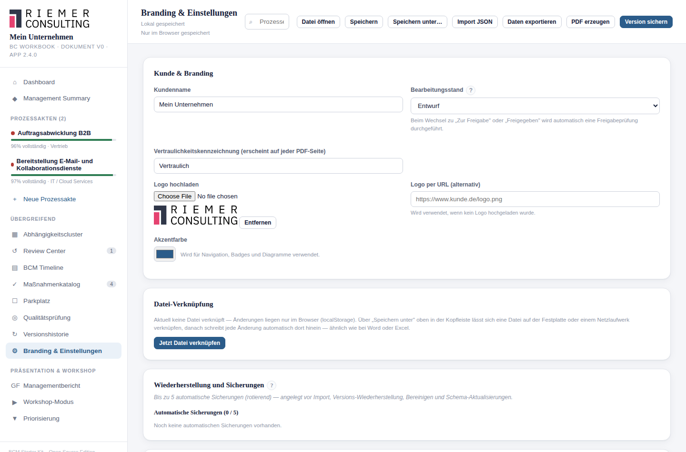

# 28. Einstellungen

## Wofür ist diese Ansicht da?

Alle allgemeinen, prozessübergreifenden Einstellungen des Workbooks sind
hier gebündelt — von Branding über Dateiverknüpfung bis zur
Lizenzinformation.

## Wo finde ich sie?

Als eigener Menüpunkt **Einstellungen** in der Seitenleiste.

## Die fünf Bereiche

### Kunde & Branding

- **Kundenname** — erscheint u. a. auf dem PDF-Deckblatt und in der
  GF-Ansicht.
- **Bearbeitungsstand** — siehe [Kapitel 24](24-freigabe.md).
- **Vertraulichkeitskennzeichnung** — erscheint auf jeder PDF-Seite (z. B.
  "Vertraulich, Nur für internen Gebrauch").
- **Logo** — per Upload oder alternativ per URL.
- **Akzentfarbe** — wird für Navigation, Badges und Diagramme verwendet.

### Datei-Verknüpfung

Zeigt, ob das Workbook mit einer Datei auf der Festplatte oder einem
Netzlaufwerk verknüpft ist (siehe [Kapitel 4](04-workbook.md)) — inklusive
der Möglichkeit, eine Verknüpfung neu herzustellen oder zu lösen. In
Browsern ohne diese Funktion erscheint stattdessen ein Hinweis, JSON-
Export/-Import zu nutzen.

### Wiederherstellung und Sicherungen

Siehe [Kapitel 26](26-datensicherung-recovery.md).

### Daten & Bedienbarkeit

- **Beispieldaten laden** — siehe [Kapitel 29](29-demo-daten.md).
- **Daten exportieren (JSON)** — siehe [Kapitel 25](25-import-export-verschluesselung.md).
- **Für Weitergabe bereinigen** — entfernt vor der Weitergabe der Datei
  persönliche/technische Spuren; siehe unten.
- **Verschlüsselter Export/Import** — siehe [Kapitel 25](25-import-export-verschluesselung.md).

Direkt darunter zeigt das Starter Kit einen Hinweis, wo Ihre Daten
tatsächlich gespeichert sind, und dass exportierte JSON-/PDF-Dateien
eigenständig geschützt werden müssen.

### Über & Lizenz

Lizenzinformationen, ein Kurzhinweis sowie Links zur vollständigen Lizenz
und einem "Über"-Dialog mit Versionsangabe.

## Für Weitergabe bereinigen

Bevor Sie eine Datei extern weitergeben oder veröffentlichen möchten,
können Sie über diese Funktion lokale, für die Weitergabe nicht
relevante Spuren entfernen. Sie haben zwei Optionen:

- **Erst als JSON sichern, dann bereinigen** — sichert zunächst Ihren
  aktuellen Stand, bevor bereinigt wird.
- **Nur bereinigen** — unmittelbar, **destruktiv**: Das Starter Kit
  verlangt zur Bestätigung die Eingabe des Worts "LÖSCHEN". Diese Aktion
  entfernt u. a. den gespeicherten Stand und die Dateiverknüpfung dieses
  Browsers vollständig.

## Was ich selbst entscheiden muss

Ob und wann eine Bereinigung sinnvoll ist, und ob vorher gesichert werden
soll, entscheiden Sie — die destruktive Variante lässt sich nicht
rückgängig machen.

## Beispiel aus der Praxis

Vor der Weitergabe einer Beispieldatei an einen externen Berater wird
zunächst über "Erst als JSON sichern, dann bereinigen" der eigene Stand
gesichert, bevor der Browser für eine anschließende Neuerfassung
bereinigt wird.

## Typische Fehler

- "Nur bereinigen" wählen, ohne vorher zu sichern — der Vorgang ist
  destruktiv und nicht umkehrbar.
- Die Akzentfarbe so wählen, dass Ampel-Farben (Rot/Gelb/Grün) im
  restlichen Workbook schwer unterscheidbar werden.

## Verwandte Kapitel

- [Das Workbook: Speichern, Dateien und Sicherung](04-workbook.md)
- [Freigabe und Release Readiness](24-freigabe.md)
- [Datensicherung und Wiederherstellung](26-datensicherung-recovery.md)
