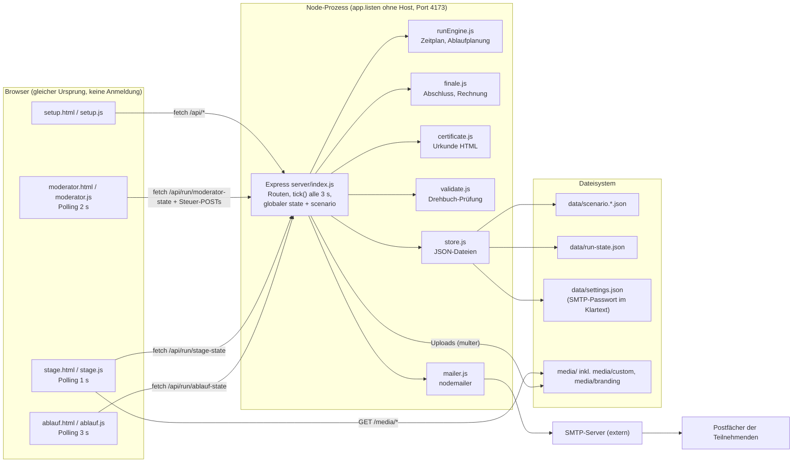
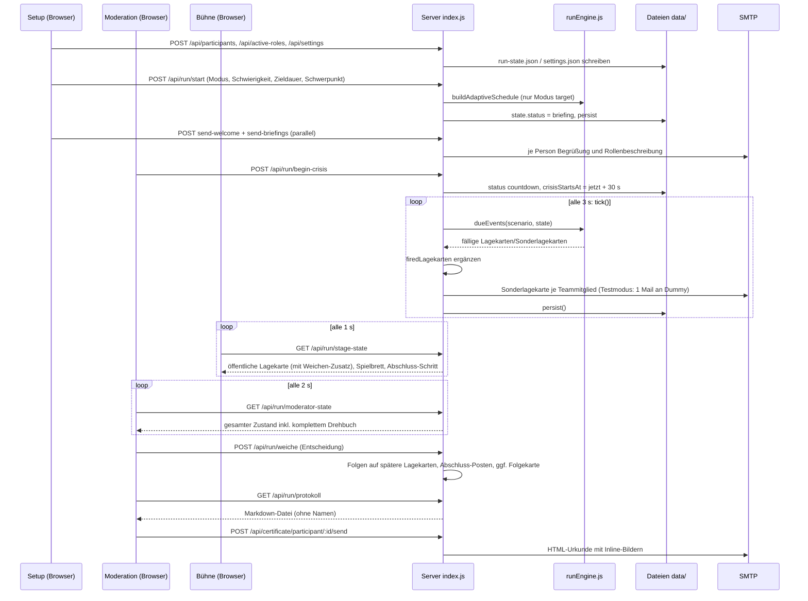

# Architektur und Datenfluss

Stand: 2026-11-18 · Codestand `07b0fb2`

## Diagramm 1

```mermaid
flowchart LR
  subgraph Browser["Browser (gleicher Ursprung, keine Anmeldung)"]
    SETUP["setup.html / setup.js"]
    MOD["moderator.html / moderator.js<br/>Polling 2 s"]
    STAGE["stage.html / stage.js<br/>Polling 1 s"]
    ABL["ablauf.html / ablauf.js<br/>Polling 3 s"]
  end

  subgraph Node["Node-Prozess (app.listen ohne Host, Port 4173)"]
    EXP["Express server/index.js<br/>Routen, tick() alle 3 s,<br/>globaler state + scenario"]
    ENG["runEngine.js<br/>Zeitplan, Ablaufplanung"]
    FIN["finale.js<br/>Abschluss, Rechnung"]
    CERT["certificate.js<br/>Urkunde HTML"]
    VAL["validate.js<br/>Drehbuch-Prüfung"]
    STO["store.js<br/>JSON-Dateien"]
    MAIL["mailer.js<br/>nodemailer"]
  end

  subgraph Disk["Dateisystem"]
    SCN["data/scenario.*.json"]
    RS["data/run-state.json"]
    SET["data/settings.json<br/>(SMTP-Passwort im Klartext)"]
    MED["media/ inkl. media/custom, media/branding"]
  end

  SMTP["SMTP-Server (extern)"]
  TN["Postfächer der Teilnehmenden"]

  SETUP -- "fetch /api/*" --> EXP
  MOD -- "fetch /api/run/moderator-state + Steuer-POSTs" --> EXP
  STAGE -- "fetch /api/run/stage-state" --> EXP
  ABL -- "fetch /api/run/ablauf-state" --> EXP
  STAGE -- "GET /media/*" --> MED
  EXP --> ENG
  EXP --> FIN
  EXP --> CERT
  EXP --> VAL
  EXP --> STO
  EXP --> MAIL
  STO --> SCN
  STO --> RS
  STO --> SET
  EXP -- "Uploads (multer)" --> MED
  MAIL --> SMTP --> TN
```

## Diagramm 2

```mermaid
sequenceDiagram
  participant S as Setup (Browser)
  participant M as Moderation (Browser)
  participant B as Bühne (Browser)
  participant X as Server index.js
  participant E as runEngine.js
  participant F as Dateien data/
  participant SM as SMTP

  S->>X: POST /api/participants, /api/active-roles, /api/settings
  X->>F: run-state.json / settings.json schreiben
  S->>X: POST /api/run/start (Modus, Schwierigkeit, Zieldauer, Schwerpunkt)
  X->>E: buildAdaptiveSchedule (nur Modus target)
  X->>F: state.status = briefing, persist
  S->>X: POST send-welcome + send-briefings (parallel)
  X->>SM: je Person Begrüßung und Rollenbeschreibung
  M->>X: POST /api/run/begin-crisis
  X->>F: status countdown, crisisStartsAt = jetzt + 30 s
  loop alle 3 s: tick()
    X->>E: dueEvents(scenario, state)
    E-->>X: fällige Lagekarten/Sonderlagekarten
    X->>X: firedLagekarten ergänzen
    X->>SM: Sonderlagekarte je Teammitglied (Testmodus: 1 Mail an Dummy)
    X->>F: persist()
  end
  loop alle 1 s
    B->>X: GET /api/run/stage-state
    X-->>B: öffentliche Lagekarte (mit Weichen-Zusatz), Spielbrett, Abschluss-Schritt
  end
  loop alle 2 s
    M->>X: GET /api/run/moderator-state
    X-->>M: gesamter Zustand inkl. komplettem Drehbuch
  end
  M->>X: POST /api/run/weiche (Entscheidung)
  X->>X: Folgen auf spätere Lagekarten, Abschluss-Posten, ggf. Folgekarte
  M->>X: GET /api/run/protokoll
  X-->>M: Markdown-Datei (ohne Namen)
  M->>X: POST /api/certificate/participant/:id/send
  X->>SM: HTML-Urkunde mit Inline-Bildern
```
